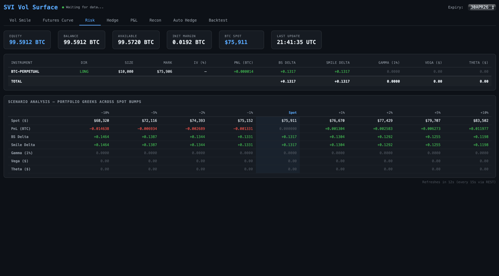
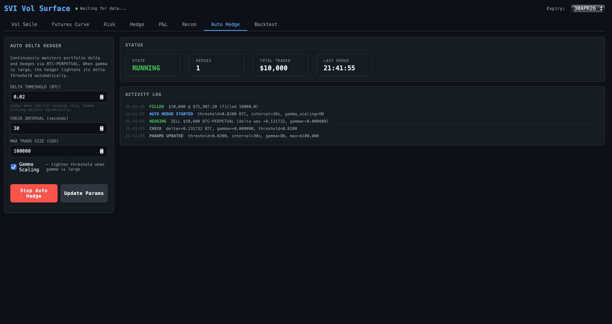

# BTC Options Trading & Risk Platform

Live SVI implied-volatility surface fitting, portfolio Greeks with scenario analysis, a gamma-aware automated delta hedger, and a hedging backtester — for BTC options and futures on Deribit.



*Risk tab: per-position Greeks and a scenario matrix of P&L, delta, gamma, vega and theta across spot bumps from −10% to +10% (running against a Deribit testnet account).*

## What it does

A single-file Flask application (`svi_ui.py`) that connects to your Deribit account and serves an eight-tab trading dashboard:

| Tab | Description |
|-----|-------------|
| **Vol Smile** | SVI model calibrated live to OTM option mark IVs. Shows the five SVI parameters, fit RMSE, ATMF vol, and Black-76 call/put premiums in BTC. |
| **Futures Curve** | Short-rate model fitted to BTC inverse futures; interpolates forward prices for any maturity. |
| **Risk** | Portfolio Greeks (BS delta, smile delta, gamma per 1% move, vega and theta in USD) per position and in total, plus scenario analysis of P&L and Greeks across spot bumps of ±1/2/5/10%. |
| **Hedge** | Computes delta, gamma and vega hedges — perpetual for delta, ATM options for gamma/vega, a 2×2 solve when hedging gamma and vega together — and executes the suggested trades. |
| **P&L** | Live equity, balance and unrealised P&L with spot/perp price charts; history persists to CSV across restarts. |
| **Recon** | Transaction reconciliation — trades, settlements, deliveries and funding — verifying independently calculated equity against the Deribit account summary. |
| **Auto Hedge** | Background delta hedger that monitors portfolio delta and rebalances via BTC-PERPETUAL, tightening its threshold automatically when gamma is large. |
| **Backtest** | Replays historical Deribit candles and simulates delta-hedging a short (or long) option position, reporting P&L, annualised Sharpe, max drawdown and trading costs. |

## How it works

**Architecture.** Python/Flask backend with a Plotly.js frontend. Three background threads stream and process data: a futures WebSocket (spot index + all inverse futures marks), an options WebSocket for the selected expiry (`ticker.<instrument>.agg2` channels), and a risk poller that pulls positions over REST. Orders are executed over an authenticated WebSocket for lower latency.

**Models.**

- **SVI calibration** — raw SVI total variance $w(k) = a + b\,(\rho(k-m) + \sqrt{(k-m)^2 + \sigma^2})$ fitted to OTM mark IVs (puts below the forward, calls above, moneyness filter $|k| < 0.25$) by L-BFGS-B from four starting points, keeping the best fit.
- **Black-76 with r = 0** — pricing and Greeks under BTC-settled inverse-contract conventions; premiums quoted in BTC.
- **Greeks by finite differences** — delta as dV<sub>USD</sub>/dF (BTC-equivalent, matching Deribit), gamma as the change in delta for a 1% spot move, vega per vol point, theta per calendar day.
- **Smile delta** — a second delta computed under sticky-delta dynamics: when spot is bumped, each option's IV is re-read from the calibrated SVI smile at its new moneyness rather than held fixed at its strike.
- **Short-rate curve** — implied rates $r = \ln(F/S)/T$ from inverse futures, interpolated with a natural cubic spline to price forwards at any maturity.

**Auto hedger with gamma scaling.** The hedger checks portfolio delta on a configurable interval and trades BTC-PERPETUAL to flatten it whenever |delta| exceeds a threshold. With gamma scaling on, the effective threshold is `base / (1 + 50·|gamma|)`, floored at 20% of base — so a high-gamma book is rebalanced with much tighter bands, since its delta moves quickly with spot. Trade sizes respect Deribit's $10 increments and a configurable per-trade cap, and every decision is written to an activity log.



*Auto Hedge tab: the hedger detects +0.13 BTC of delta, sells $10,000 of BTC-PERPETUAL to flatten it, and logs the fill.*

**Backtester.** Fetches historical OHLCV candles from Deribit's public API (paginated), simulates an option position at a chosen strike offset, IV and expiry, and delta-hedges with the perpetual at a configurable interval, delta threshold and transaction cost. Reports total P&L in BTC, annualised Sharpe, max drawdown and hedge count.

## Getting started

```bash
pip install -r requirements.txt
python3 svi_ui.py
```

Open http://localhost:5050 and sign in with your Deribit API credentials.

**You supply your own API keys — nothing is hardcoded.** Create a key at [Deribit Testnet](https://test.deribit.com/account/BTC/api) (recommended) or [Deribit Production](https://www.deribit.com/account/BTC/api), and choose the matching network on the login page. Credentials are validated against Deribit, held in process memory for the session only, and never written to disk.

To skip the login page (e.g. local development), set environment variables instead:

```bash
export DERIBIT_CLIENT_ID="your_id"
export DERIBIT_CLIENT_SECRET="your_secret"
export DERIBIT_NETWORK="testnet"   # or "mainnet"
python3 svi_ui.py
```

> **Note:** the Hedge and Auto Hedge tabs place real orders on whichever network you sign in to. Use a testnet account unless you mean it.

## Browser-only version

`index.html` is a standalone client-side implementation of the Vol Smile and Futures Curve tabs — SVI calibration included — using only Deribit's public API, so no keys are needed. Open it directly or visit [mustafa-os.github.io/BTC-Trading-Project](https://mustafa-os.github.io/BTC-Trading-Project/).

## Tech stack

Python, Flask, NumPy, SciPy (L-BFGS-B, cubic splines), websocket-client, Plotly.js · Deribit REST + WebSocket APIs

## Project context

Personal project, built March–April 2026 to learn options market-making mechanics — volatility surface fitting, Greeks under inverse-contract conventions, and the practical trade-offs of delta hedging.

---

Built by Mustafa Suleman — MEng Design Engineering, Imperial College London · [LinkedIn](https://www.linkedin.com/in/mustafaosuleman/)
